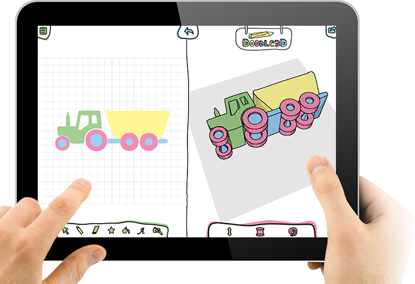

# Doodle3D-App
Doodle3D Transform is a free and open-source web-app that makes designing in 3D easy and fun! Created with love by Casper, Peter, Rick, Nico, Jeroen, Simon, Donna and Arne in 2015-2017. With the support of 1,626 Kickstarter backers.

In 2021 we updated Doodle3D Transform to work completely on the client-side. There is no server sided-code and/or user management anymore.

As of 2021-05-26 Doodle3D Transform is distributed under the MIT License. This gives everyone the freedoms to use Doodle3D Transform in any context: commercial or non-commercial, public or private, open or closed source.



## Run online
https://doodle3d.com

## Build & run locally
```bash
git clone git@github.com:Doodle3D/Doodle3D-Transform.git
cd Doodle3D-Transform
npm install    # Make sure you have installed NPM / NodeJS
npm run start
# visit http://localhost:8080
```
